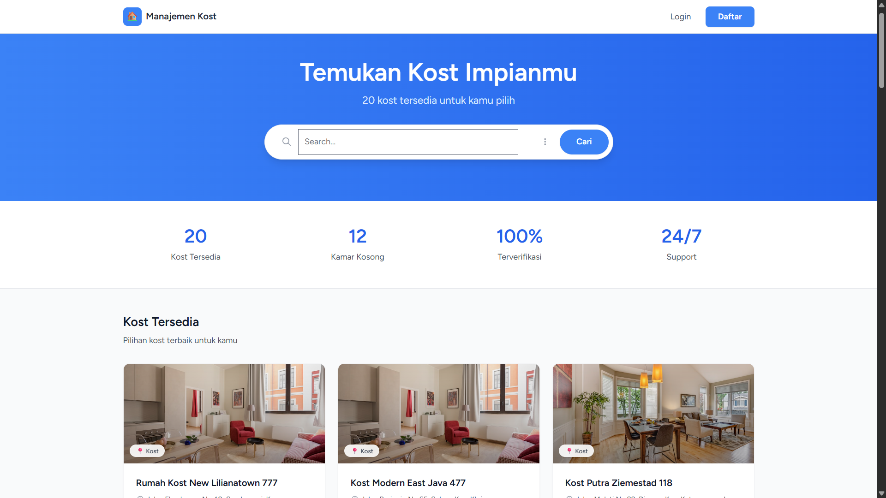
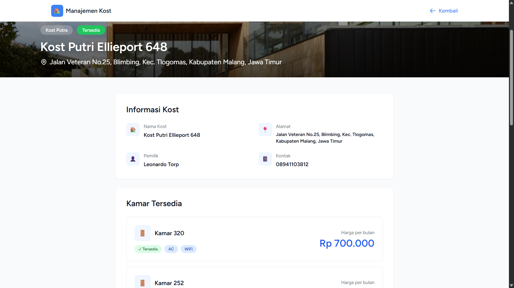
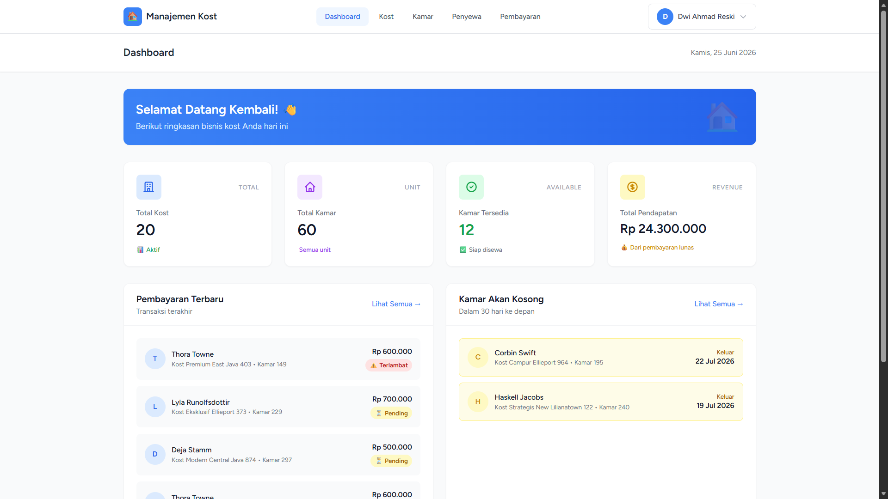
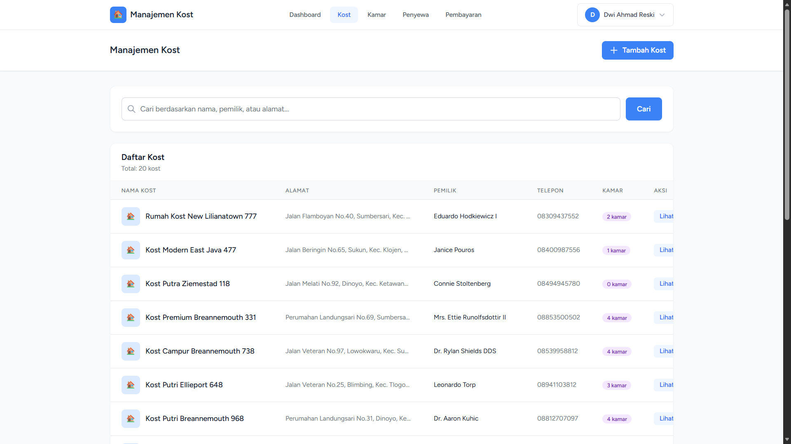

# Aplikasi Manajemen Kost

Sistem informasi manajemen kost berbasis web yang modern, responsif, dan mudah digunakan. Aplikasi ini membantu pemilik kost dalam mengelola data kost, kamar, penyewa, serta mencatat dan melaporkan pembayaran secara digital.


## ✨ Fitur Utama

### Public Website

- **Landing Page** - Halaman pencarian kost dengan foto menarik
- **Detail Kost** - Informasi lengkap dengan foto, fasilitas, dan kontak pemilik
- **Search & Filter** - Cari kost berdasarkan nama/lokasi dan filter harga
- **Kontak Langsung** - Tombol WhatsApp dan Telepon untuk hubungi pemilik

### 🔐 Admin Panel

- **Dashboard** - Statistik real-time (total kost, kamar, penyewa, pendapatan)
- **Manajemen Kost** - CRUD data kost dengan foto
- **Manajemen Kamar** - CRUD kamar dengan filter status
- **Manajemen Penyewa** - Data penyewa dengan auto-update status kamar
- **Manajemen Pembayaran** - Pencatatan pembayaran dengan export PDF
- **Export Laporan** - Cetak laporan pembayaran dalam format PDF

### 🎨 UI/UX

- **Design Modern** - Clean, minimalis, dan profesional
- **Responsive** - Tampilan optimal di desktop, tablet, dan mobile
- **User Friendly** - Navigasi mudah dan intuitif

## 🛠️ Tech Stack

- **Backend:** Laravel 11 (PHP 8.3)
- **Frontend:** React 18 + Inertia.js
- **Styling:** Tailwind CSS
- **Database:** MySQL 8.0
- **PDF Generator:** barryvdh/laravel-dompdf
- **Authentication:** Laravel Breeze

## 📸 Screenshot

### Public Website




### Admin Panel




## 🚀 Cara Instalasi

### Prasyarat

- PHP 8.3 atau lebih baru
- Composer
- Node.js 18+ dan NPM
- MySQL 8.0
- Docker (opsional, untuk database)

### 1. Clone Repository

```bash
git clone https://github.com/username-kamu/manajemen-kost.git
cd manajemen-kost
```
